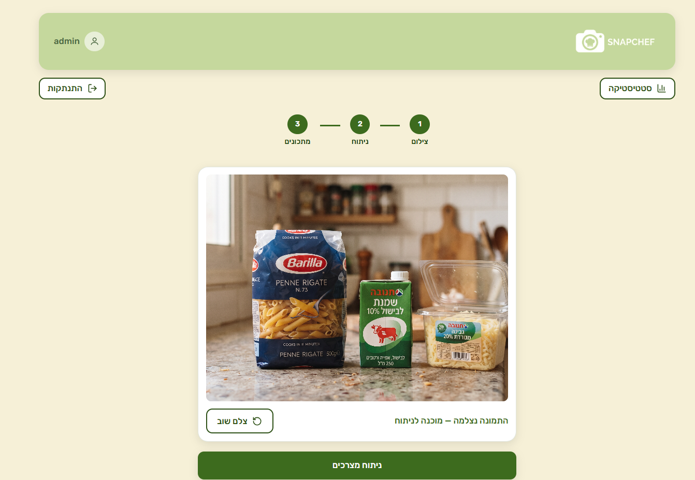
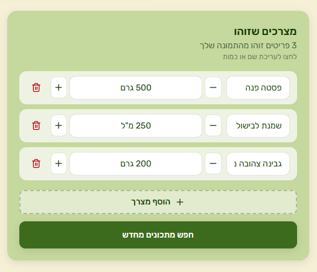
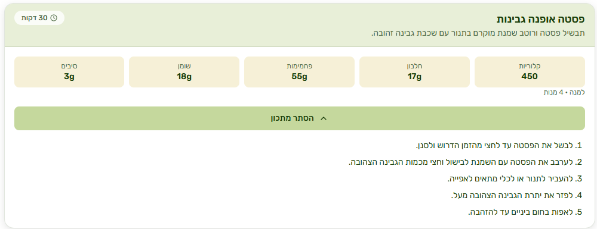
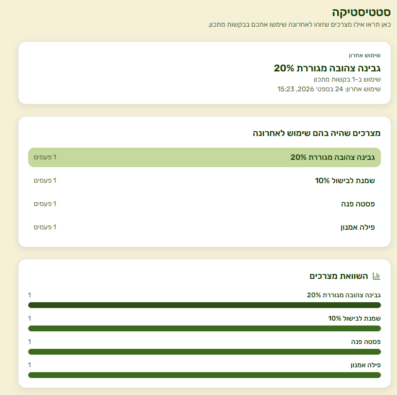

                                                        SnapChef 

**מפתחי התוכנה:** טל חלבני, ויטלי ברלב

מערכת חכמה המציעה למשתמש מתכונים מותאמים אישית לפי תמונה או צילום ישיר של מצרכים במכשיר הפלאפון, שומרת מתכונים אחרונים ומבצעת ניתוח סטטיסטי של שימוש במצרכים.

---

## תמונות מהתוכנית

### העלאת תמונה
מסך העלאת הצילום או התמונה של המצרכים למערכת.

### זיהוי מצרכים
מערכת הניתוח מזהה את הפריטים מהתמונה ומאפשרת עריכה של שמות או כמיות המצרכים.

### הצגת מתכון וערכים תזונתיים
מתכון מפורט הכולל שלבי הכנה, זמן הכנה ופירוט קלוריות וערכים תזונתיים למנה.

### אזור סטטיסטיקה
לוח בקרה המציג את המצרך האחרון ששימש לבקשת מתכון, רשימת המצרכים בשימוש אחרוני, והשוואת כמויות בגרף.

---

## מאפיינים וכלים בתוכנית

* **כניסת משתמשים מאובטחת:** התוכנית מאפשרת כניסה מאובטחת לפרופיל באמצעות שם משתמש וסיסמה.
* **כפתור סטטיסטיקה:** מאפשר להיכנס לאזור הסטטיסטיקה של התוכנית המציג את המצרך האחרון שמשתמש בדק עבורו מתכון, יחד עם שאר המצרכים וכמות הפעמים שנבדקו בתצוגת גרף.
* **פירוט קלוריות למנה:** כל מתכון מגיע עם ערכים תזונתיים וקלוריות מדויקים.
* **מתכונים אחרונים:** למשתמש מוצגים מתכונים אחרונים בהם בחר מתוך המצרכים שהציג למערכת.
* **ניתוח תצלום או תמונה למציאת מתכון:** ניתוח מתקדם באמצעות בינה מלאכותית (GEMINI FLASH) למציאת מתכון המבוסס על המצרכים המופיעים בתמונה.

---

## התקנה ודרישות

* נדרש מחשב או מכשיר נייד עם חיבור יציב לאינטרנט.
* נדרשת הרשמה לשימוש וכניסה למערכת.
* לחוויית משתמש טובה יותר מומלץ להשתמש במכשיר עם מצלמה (אך אינו חובה).
